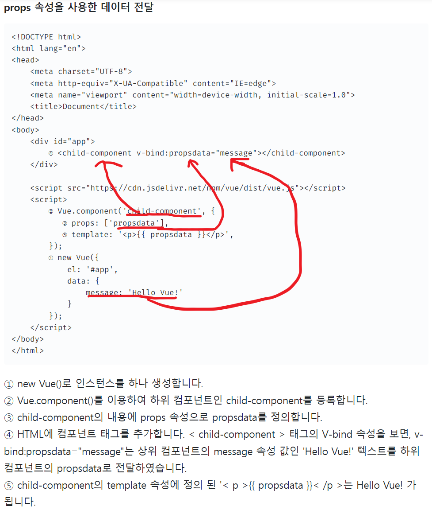

# <a src="https://www.youtube.com/watch?v=ybFZK1-01zk">컴포넌트 생성 및 사용 영상</a>

# 위 영상 참고 후 props영상보면 상당한 도움이 된다.
- <a src="https://www.youtube.com/watch?v=L8VLByQLtjc&t=1s">porps 참고영상 06:00분 부터 </a><br>
- <a src="https://www.youtube.com/watch?v=7T8F7ZF52lo">props 활용영상 </a><br>
- <a src="https://velog.io/@ducks1077/Vue.js-props-emit-%EA%B0%9C%EB%85%90-%EC%A0%95%ED%99%95%ED%95%98%EA%B2%8C-%EC%9E%A1%EA%B8%B0">props 참고 사이트</a>
- <a src="https://v3.ko.vuejs.org/guide/component-props.html#%E1%84%83%E1%85%A1%E1%86%AB%E1%84%87%E1%85%A1%E1%86%BC%E1%84%92%E1%85%A3%E1%86%BC-%E1%84%83%E1%85%A6%E1%84%8B%E1%85%B5%E1%84%90%E1%85%A5-%E1%84%92%E1%85%B3%E1%84%85%E1%85%B3%E1%86%B7">props Reference</a>
## props(property) => 부모 컴포넌트에서 자식 컴포넌트로 어떤 정보를 넘겨줄 때 사용하는 프로퍼티!
```
	+ props에 있는 데이터들은 수정이 불가능하며 오직 안에있는 값을 꺼내서 사용할수만 있습니다.
	+ props는 Array형태로 값을 받게 된다.
```

## props로 전달받은 데이터는 마음대로 변경하면 안 됨
```
+ 메서드 내부에서는 this를 사용해서 자기 자신의 데이터처럼 사용할 수 있다. props는 리액티브 상태이므로 부모 쪽에서 데이터를 변경하면 자식 쪽의 상태도 변경된다.
+ 만약 자식 컴포넌트에서 데이터 변경을 추가하고 싶은 경우는 산출 속성을 사용해서 새로운 데이터를 생성해야 한다. 
	원래 데이터 자체를 변경해야 하는 경우, $emit을 사용해서 부모에 액션을 일으켜 부모 쪽을 변경한다.
```
## Note
```HTML
+ 자바스크립트의 객체와 배열은 참조로 전달되므로 prop가 배열 또는 객체인 경우 하위 컴포넌트 내부의 객체 또는 배열 자체를 변경하면 상위 상태에 영향을 줄 것입니다.
+ Prop 대소문자 구분(camelCase vs kebab-case)
	* HTML 속성명은 대소문자를 구분하지 않으므로, 브라우저는 모든 대문자를 소문자로 해석한다. 그리하여 케밥-케이스로 사용한다.
		ex) 
		<!-- HTML에서는 카멜표기법(X)  kebab-case(O) -->
			<blog-post post-title="hello!"></blog-post>

			<script>
				const app = Vue.createApp({})

				app.component('blog-post', {
				  // JavaScript에서의 camelCase
				  props: ['postTitle'],
				  template: '<h3>{{ postTitle }}</h3>'
				})
			</script>
```


